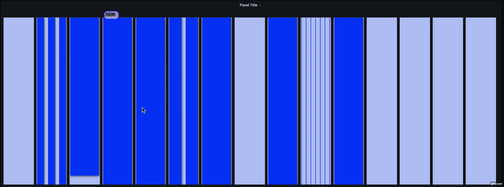

# MASH

Welcome to the newest product from Envoya, MASH!

As the scale of your product grows, so does the complexity, and nowhere more so than in your message passing and stream processing infrastructure.

MASH makes it easy to see your most important metrics at a glance. Made specifically to visualize your Kafka cluster, MASH brings you a novel way to simply understand the health of your consumers, and show metrics such as consumer lag in a way that can be understood instantly.

Organization of data such as the average and outlier message consumption rates is also presented clearly and concisely.

(Put in a picture showing the consumer_messages panel)

In addition to the visulization of these critical metrics, MASH also provides an integrated testbed for message production and consumption to an existing or test Kafka cluster.

Using the control panel, you can create topics and produce messages to them in a clean and efficient way. You can also create consumer groups and consume messages with instant feedback.

(Insert picture of the control panel)

TO USE:

MASH is integrated tightly into the tools you already use. MASH uses the Grafana platform to present its panels and dashboards. In addition, MASH uses Prometheus with the Kafka Exporter for data collection and aggregation.

MASH will need a running instance of Kafka, along with Kafka Exporter and Prometheus. If you are not currently integrated with Prometheus and Kafka Exporter, or are creating a new Grafana instance, a docker-compose file has been provided for your convenience.

The docker-compose file will spin up docker containers with the following:

- Kafka

- Zookeeper

- Prometheus (available at port 9090)

- Kafka Exporter

- Grafana (available at port 3000)

- The MASH Testbed (available at port 2022)

USING THE TESTBED:

As part of developing MASH, our team attempted to procure a testing platform which would allow us to produce mock data to the Kafka platform, but unfortunately none were available in our preferred language and tech stack. Since we wanted control over the process, we developed an internal testing platform which we feel can provide useful functionality to others.

Therefore, we have incorporated the testbed into the MASH package. This can be controlled through Grafana by using the Control Panel. This will provide the current topics of your Kafka instance, along with the ability to send and consume messages from the cluster through a proxy server, and to create new topics and produce messages to them.

A near-term goal for MASH is to incorporate customizable data for more control of the test data produced through the platform.
